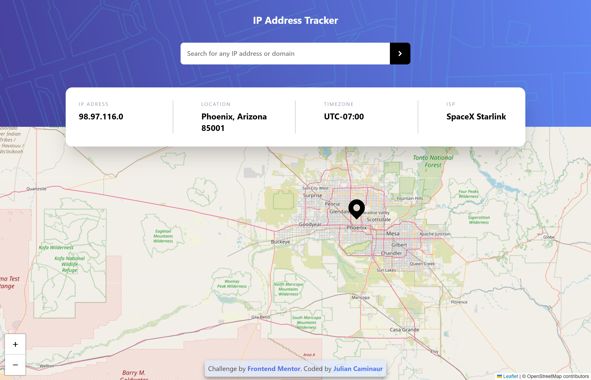
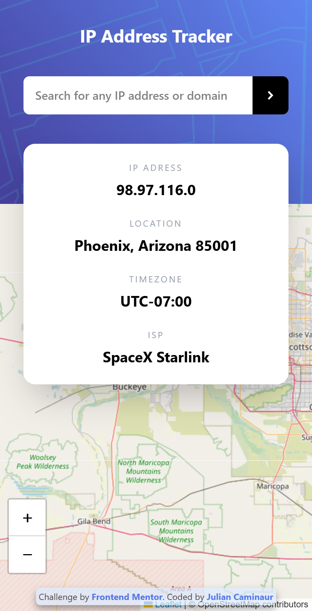

# Frontend Mentor - IP address tracker solution Solution

This is a solution to the [IP address tracker solution challenge on Frontend Mentor](https://www.frontendmentor.io/challenges/)

## Table of contents

- [Overview](#overview)
  - [The challenge](#the-challenge)
  - [My Solution](#my-solution)
    - [Desktop](#desktop)
    - [Mobile](#mobile)
  - [Links](#links)
- [My process](#my-process)
  - [Built with](#built-with)
  - [Continued development](#continued-development)
  - [Useful resources](#useful-resources)
- [Author](#author)

## Overview

### The challenge

Users should be able to:

- View the optimal layout for each page depending on their device's screen size
- See hover states for all interactive elements on the page
- See their own IP address on the map on the initial page load
- Search for any IP addresses or domains and see the key information and location

### My Solution

#### Desktop

#### Mobile

### Links

- Live Site URL: [Live site](url)
- Solution URL: [Github](https://github.com/Caminaur/IP-address-tracker)

## My Process

This was a great challenge to experiment with React custom hooks and get more comfortable with TypeScript.

### Built with

- Mobile-first workflow
- [React](https://reactjs.org/)
- [Tailwind](https://tailwindcss.com/)
- [TypeScript](https://www.typescriptlang.org/docs/handbook/intro.html)

### Continued development

I would like to improve my planning so I could create better and more organize projects from the get-go

### Useful resources

- [Custom Hooks in React (Design Patterns)](https://www.youtube.com/watch?v=I2Bgi0Qcdvc) - This video helped me to understand how to properly use custom hooks while following good design patterns.

## Author

- [Website](https://julian-caminaur.tech/)
- [Frontend Mentor](https://www.frontendmentor.io/profile/Caminaur)
- [CSS Battle](https://cssbattle.dev/player/caminaur)
- [Exercism](https://exercism.org/profiles/Caminaur)
